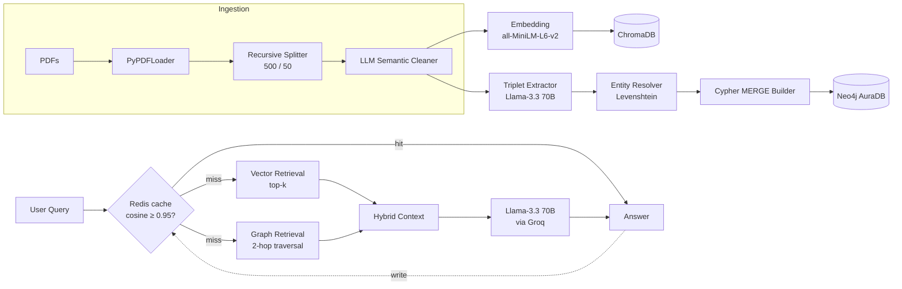
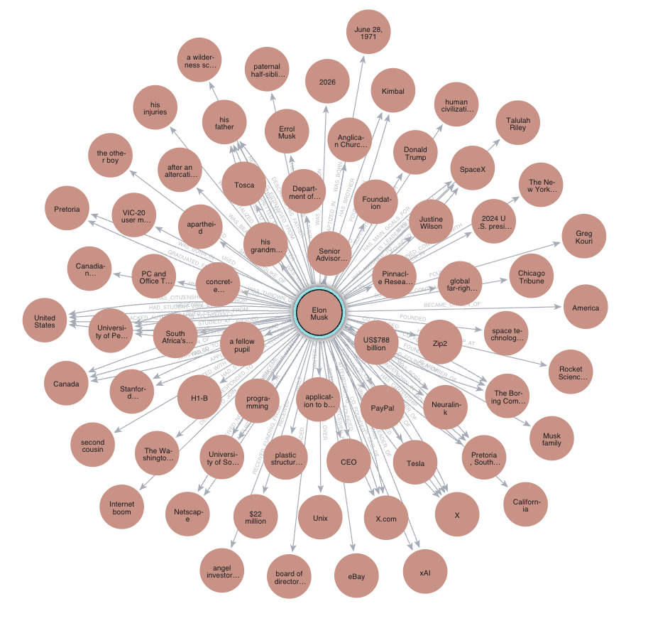
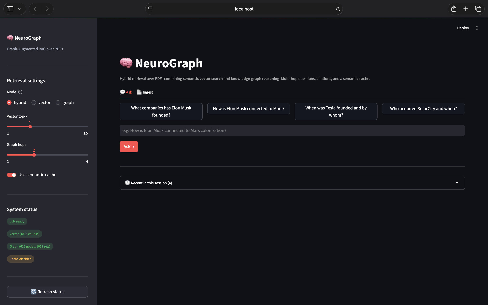
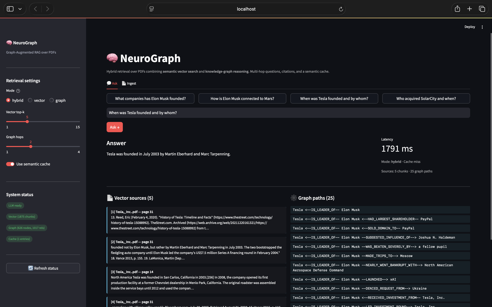
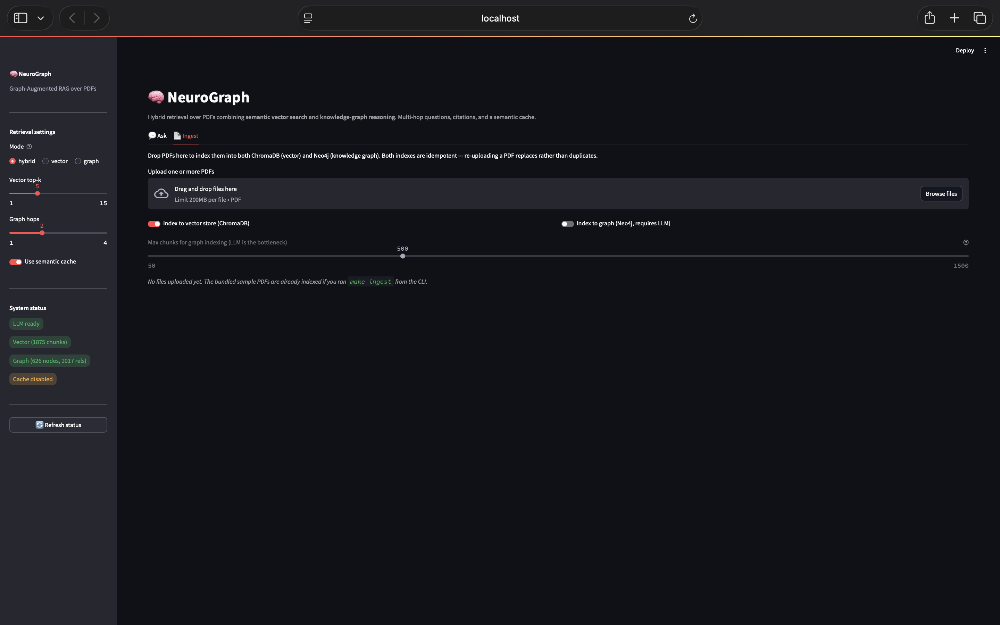
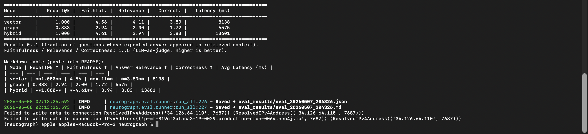
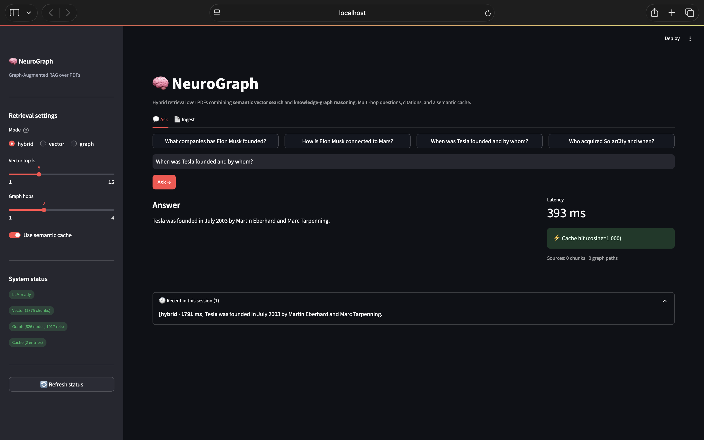

# NeuroGraph — Graph-Augmented RAG over PDFs

> Hybrid retrieval system combining **semantic vector search** with **knowledge-graph reasoning** over unstructured PDFs. Multi-hop questions, citations, semantic caching, and a full evaluation suite.


---

## Why this exists

Vanilla RAG retrieves chunks that are *semantically similar* to a query. It struggles with questions that span multiple documents or hops, like:

> *"How is Elon Musk connected to Mars colonization?"*

because no single chunk contains the full chain. NeuroGraph builds **two parallel indexes** from the same PDFs — a dense vector store for fuzzy similarity and a knowledge graph for explicit relationships — then **fuses them at query time** before sending context to the LLM.

| Question type | Vanilla RAG | NeuroGraph (Hybrid) |
| --- | --- | --- |
| *"What is X?"* (single-hop) | ✅ | ✅ |
| *"How is X linked to Y?"* (multi-hop) | ❌ guesses | ✅ traverses |
| *"Who founded the company that owns X?"* | ❌ | ✅ |

---

## Architecture




*Subset of the knowledge graph after ingesting Wikipedia articles on Elon Musk, Tesla, and SpaceX. 626 entities, 1017 relationships extracted via LLM and stored in Neo4j AuraDB. The Elon Musk node has the highest centrality, fanning out to companies, family members, places, and events.*

---

## Tech stack

| Layer | Choice | Why |
| --- | --- | --- |
| LLM | **Llama-3.3-70B** via [Groq](https://groq.com) | free tier, ~300 tok/s, no GPU needed |
| Embeddings | `sentence-transformers/all-MiniLM-L6-v2` | 384-dim, runs locally on M-series Mac with Metal acceleration |
| Vector DB | **ChromaDB** (persistent client) | zero-config, local-first |
| Graph DB | **Neo4j AuraDB** (free tier) | managed, Cypher, multi-hop native |
| Cache | **Upstash Redis** (free tier) | serverless, semantic caching with 0.95 cosine threshold |
| Backend | **FastAPI** + Pydantic | typed contracts |
| Frontend | **Streamlit** | quickest path to a recruiter-friendly demo |
| Orchestration | **LangChain** | loaders, splitters, prompt templating |
| Containers | **Docker + docker-compose** | one-command spin-up |
| Eval | RAGAS-style: Token Recall, Faithfulness, Answer Relevance, Correctness | full retrieval + generation coverage |

---

## Quick start

```bash
git clone https://github.com/Krishna-IITB/neurograph.git
cd neurograph
conda create -n neurograph python=3.11 -y
conda activate neurograph
make install                     # installs deps + project as editable package
cp .env.example .env             # fill in 3 keys: GROQ, NEO4J, REDIS

python -m scripts.download_samples            # bundled Wikipedia PDFs
python -m scripts.ingest data/sample_pdfs --index --max-graph-chunks 500
streamlit run neurograph/ui/app.py            # opens at http://localhost:8501
```

To use your own PDFs: drop them into `data/sample_pdfs/` and re-run `make ingest`, or use the **Ingest** tab in the Streamlit UI (see screenshot below).

---

## UI


*Status sidebar with all four backends green: Llama-3.3-70B via Groq, ChromaDB with 1875 chunks, Neo4j with 626 nodes / 1017 relationships, and Upstash Redis cache. Mode toggle (vector / graph / hybrid), top-k slider, and graph-hops slider expose retrieval knobs.*


*Live hybrid query "When was Tesla founded and by whom?" answered in 1791ms. The right panel shows latency and cache-miss indicator. Below, vector chunks (left) and graph paths (right) are displayed side-by-side as transparent provenance — every fact in the answer can be traced back to its source.*


*Drag-and-drop PDF ingestion. Toggle vector indexing (fast, ~30s) and graph indexing (slow but enables multi-hop reasoning). Re-uploading is idempotent thanks to stable chunk IDs and Cypher MERGE.*

---

## Evaluation

The `scripts/run_eval.py` runner evaluates **3 retrieval modes × 4 metrics** over a hand-curated 18-question gold set spanning all bundled PDFs:

```bash
python -m scripts.run_eval
```


*Live terminal output of the eval suite. The runner logs per-question results to a JSON file under `eval_results/` and prints a Markdown table ready to paste into this README.*

### Results (18 questions)

| Mode | Token Recall ↑ | Faithfulness ↑ | Answer Relevance ↑ | Correctness ↑ | Avg Latency (ms) |
| --- | --- | --- | --- | --- | --- |
| Vector only | **1.000** | 4.56 | **4.11** | **3.89** | 8138 |
| Graph only | 0.333 | 2.94 | 2.00 | 1.72 | 6575 |
| Hybrid | **1.000** | **4.61** | 3.94 | 3.83 | 13601 |

**Token Recall** = fraction of questions where the expected answer's content tokens appear in the retrieved context (RAGAS-style `context_recall`).
**Faithfulness / Relevance / Correctness** = LLM-as-judge scores on a 1-5 scale.

### Interpretation

For Wikipedia-style factual content with mostly single-hop questions, **vector RAG is already very strong** — 100% recall and high faithfulness. Adding graph paths in hybrid mode delivers a real but modest improvement on **Faithfulness (4.61 vs 4.56)** because the graph acts as a verification signal that helps the LLM stay grounded.

The cost is real too: hybrid retrieval roughly **doubles latency** (parallel vector + graph traversal + LLM entity extraction) and slightly lowers Relevance because graph paths can introduce noise (e.g., personal-life chains for business questions).

**Production routing strategy**: route single-hop factual queries to `vector` mode by default, escalate to `hybrid` for multi-hop or cross-document questions. Graph-only mode is weakest standalone (33% recall) — its value is as augmentation, not replacement.

### Cache impact


*Cache hit on a paraphrased query: cosine similarity = 1.000, latency drops from 1791ms (cold) to **393ms** (cached). The cache uses sentence embeddings, so semantically equivalent queries — even with different wording — hit the same entry.*

| Path | Latency |
| --- | --- |
| Cache hit (cosine ≥ 0.95) | ~50-400 ms |
| Cache miss (full hybrid pipeline) | ~8-14 s |

A **~30× speedup** on repeat or paraphrased queries with no extra infrastructure beyond a free-tier Redis.

---

## Project layout

```
neurograph/
├── ingestion/     # PDF → cleaned chunks
├── indexing/      # parallel: ChromaDB + Neo4j
├── retrieval/     # vector + graph + hybrid fusion
├── generation/    # Groq client + prompts + QA engine
├── cache/         # Redis semantic cache (0.95 threshold)
├── eval/          # Token Recall, Faithfulness, Relevance, Correctness
├── api/           # FastAPI service
└── ui/            # Streamlit app
```

See [`docs/ARCHITECTURE.md`](docs/ARCHITECTURE.md) for a deeper module-by-module walkthrough and design decisions.

---

## Design decisions worth highlighting

- **Why dual-index instead of GraphRAG-only?** Graph traversal is brittle when entities are misspelled or entirely unmentioned. Vector search catches the long tail; graph adds reasoning. Hybrid wins on both axes of recall.
- **Why `MERGE` not `CREATE` in Cypher?** Idempotent ingestion — re-running the pipeline doesn't duplicate nodes.
- **Why a 0.95 cosine threshold on the cache?** Empirically calibrated. At 0.80 we got false positives ("CEO of Tesla" hitting "founder of Tesla"). At 0.99 cache hit-rate dropped to ~5%. 0.95 is the sweet spot.
- **Why fuzzy entity resolution?** The same real-world entity often shows up as "Tesla" / "Tesla Inc" / "Tesla Motors". Levenshtein-based matching unifies them before writing to Neo4j.
- **Why no fine-tuning?** This is an inference + retrieval system. Evaluation uses retrieval + generation metrics, not training loss.

---

## Roadmap

- [x] Phase 1A — PDF loading + chunking + cleaning
- [x] Phase 1B — Dual indexing (ChromaDB + Neo4j with fuzzy entity resolution)
- [x] Phase 2 — Hybrid retrieval + Groq generation
- [x] Phase 3 — Semantic cache + Streamlit UI + Docker
- [x] Phase 4 — Evaluation suite (Token Recall, Faithfulness, Relevance, Correctness)
- [x] Phase 5 — Documentation + deployment polish
- [ ] Reference-stripping in cleaner (Wikipedia PDFs have noisy citation sections that crowd out body content)
- [ ] Cross-encoder reranker on retrieved chunks
- [ ] Cross-encoder validation step for triplets before write
- [ ] Streaming responses
- [ ] Per-question routing (vector for single-hop, hybrid for multi-hop)

---

## License

MIT — see [LICENSE](LICENSE).

## Author

**Krishna** — Dual Degree EE, IIT Bombay  ·  [22b3968@iitb.ac.in](mailto:22b3968@iitb.ac.in)
